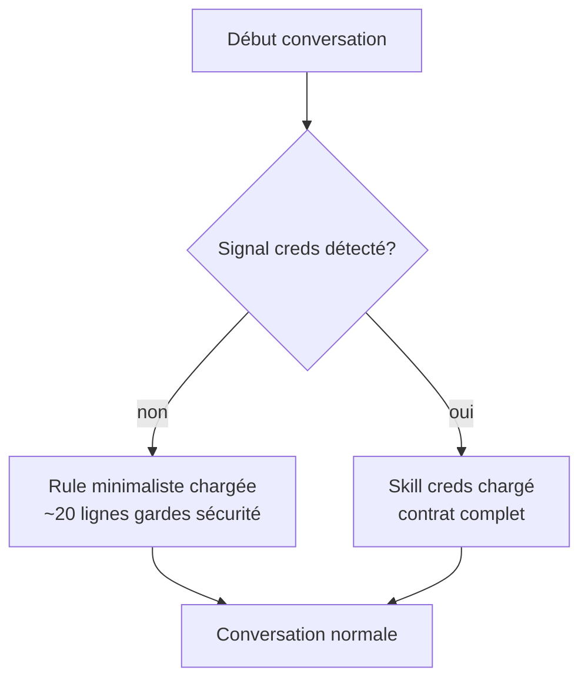

# Design — Migration rule → skill `creds`

**Date :** 2026-04-08
**Projet :** keychain-creds
**Objectif :** Remplacer la rule globale `keychain-creds.md` (8454 octets, chargée systématiquement) par un skill `creds` à déclenchement conditionnel.

---

## Problème

`~/.claude/rules/keychain-creds.md` (et son identique `~/projects/keychain-creds/.claude/rules/keychain-creds.md`) sont chargés dans **chaque conversation** du projet. Ce document de 8454 octets décrit le contrat complet du CLI `creds`, mais il est inutile dans la majorité des conversations (refactoring, tests, docs, etc.).

---

## Solution

Transformer la rule en **skill `creds`** avec frontmatter précis. Le skill se charge uniquement quand Claude détecte un signal pertinent (code utilisant creds, questions sur les commandes, scripts avec secrets).

---

## Architecture cible

```
~/.claude/skills/creds
  → ~/projects/keychain-creds/.claude/skills/creds/SKILL.md  (symlink via cc-hub)

~/projects/keychain-creds/.claude/rules/keychain-creds.md  (réduite à ~20 lignes — gardes comportementales)
~/.claude/rules/keychain-creds.md  (supprimée après validation)
```

---

## Composants

### 1. Skill `creds` — `SKILL.md`

**Emplacement :** `~/projects/keychain-creds/.claude/skills/creds/SKILL.md`

**Frontmatter :**
```yaml
---
name: creds
description: |
  Load when writing code or shell scripts that use the `creds` CLI,
  when injecting secrets from the macOS Keychain, when asked about
  `creds set`, `creds get`, `creds env`, or `creds rm` commands,
  entry naming conventions (namespace/env/name), exit codes, or
  secret injection patterns. Also load when reviewing or debugging
  code that uses the creds binary, or when writing macOS Shortcuts
  that call creds.
---
```

**Corps :** Contenu intégral de la rule actuelle, restructuré en guide d'usage :
- Commandes disponibles (set, get, env, rm)
- Options globales
- Convention des entries
- Mapping Keychain
- Exit codes
- Recettes (do)
- Anti-patterns (don't)
- Rappels Shortcuts macOS

### 2. Rule minimaliste (projet)

**Emplacement :** `~/projects/keychain-creds/.claude/rules/keychain-creds.md`

**Contenu (~20 lignes) :** Uniquement les gardes comportementales impératives :
- Ne jamais utiliser `exec()` → toujours `execFile()`
- Ne jamais construire une commande shell par concaténation de chaînes
- Ne jamais logger la valeur retournée par `creds get`
- Ne jamais passer un secret en argument CLI

Ces gardes sont **impératives** (doivent s'appliquer même sans que Claude charge le skill) et distinctes du contrat documentaire.

### 3. Suppression

`~/.claude/rules/keychain-creds.md` est supprimée **après** validation du trigger du skill.

---

## Séquence d'implémentation

1. **Créer** `~/projects/keychain-creds/.claude/skills/creds/SKILL.md`
2. **Réduire** `~/projects/keychain-creds/.claude/rules/keychain-creds.md` aux gardes comportementales
3. **Lier** globalement : `cc-hub skill link ~/projects/keychain-creds/.claude/skills/creds`
4. **Invoquer** `/meta-skill-creator` pour optimiser le frontmatter
5. **Supprimer** `~/.claude/rules/keychain-creds.md`
6. **Committer** les changements dans keychain-creds

---

## Flux de chargement (après migration)



---

## Validation

Avant suppression de la rule globale, tester le trigger sur 3 prompts :
1. "Comment stocker une clé API avec creds ?" → skill doit se charger ✓
2. "Écris un script qui utilise `creds get`" → skill doit se charger ✓
3. "Comment fonctionne le routing dans Express ?" → skill ne doit PAS se charger ✓

---

## Points de vigilance

- Le symlink doit pointer vers le **répertoire** `creds/`, pas vers `SKILL.md`
- `/meta-skill-creator` peut modifier le frontmatter → re-vérifier le trigger après optimisation
- La rule globale `~/.claude/rules/keychain-creds.md` est un **fichier direct** (pas un symlink) — sa suppression est définitive, vérifier avant d'agir
- Les autres projets utilisant `creds` (cc-hub, etc.) perdent les gardes automatiques → compensé par le skill accessible globalement via symlink
